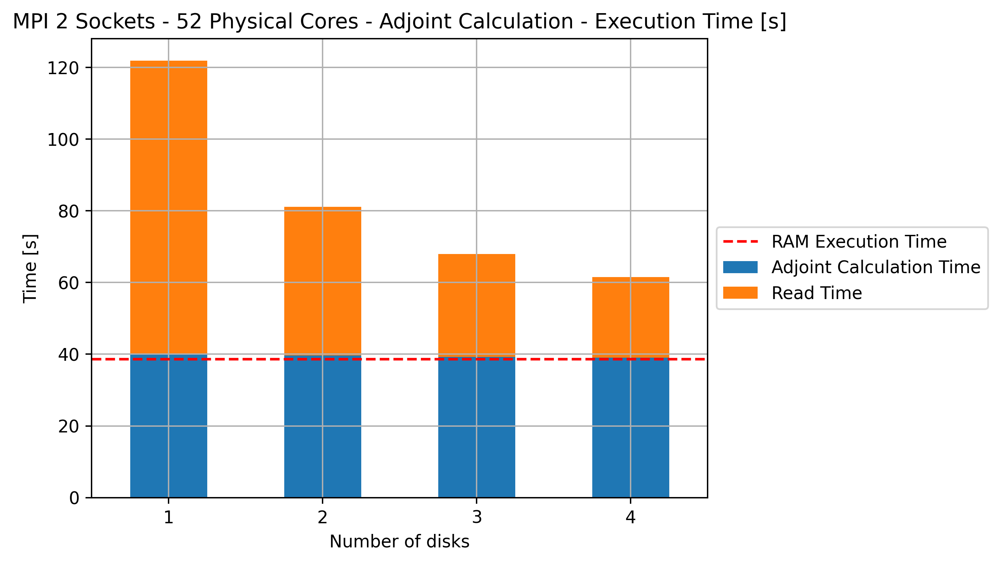
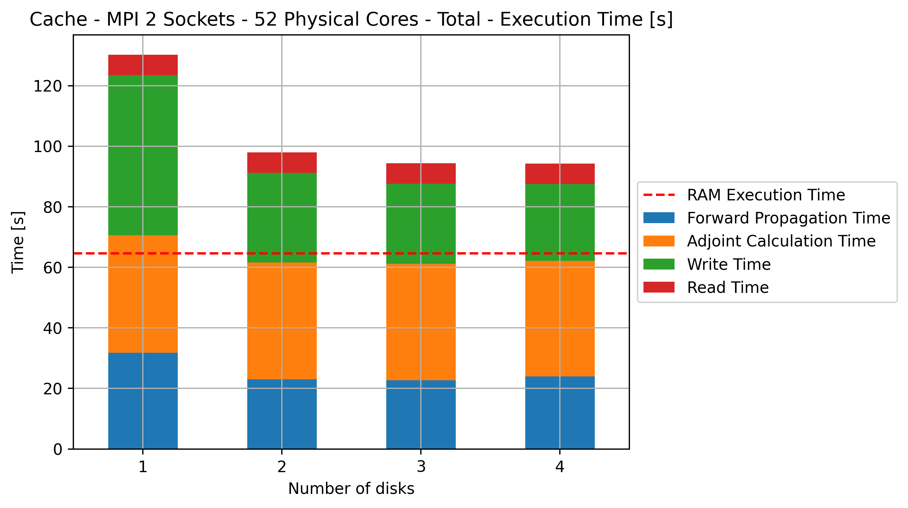

# Offloading to Nvme: A Hardware Alternative to Checkpointing - Overthrust Experiments - SIAM 23 / Computers & Geosciences

# About

Full-Waveform Inversion (FWI) is an adjoint-based optimization commonly used in geophysical exploration. Like other adjoint-based optimizations, the gradient calculations in FWI impose an enormous memory footprint. This memory footprint is often considered the most significant bottleneck in this process and has been the subject of lots of considerable past research. This includes work on checkpointing, lossy compression, subsampling in time, and many other solutions designed to reduce this memory footprint. A common assumption behind all this past work has been that writing this data to disk would lead to a significant and unacceptable slowdown, which leads us to accept lower precision results or higher computational costs to trade off memory. In this work, we test this assumption in light of recent developments in high-bandwidth storage (i.e. NVMes). We find that for certain combinations of modern hardware, it might be possible to write the temporary data to disk during the forward propagation and read it back during the adjoint computation without significant slowdowns.

## Requirements:

* make
* docker

## How to run

1. If you are using Oracle Cloud DenseIO.52 instance the only command necessary is:

```shell
make oracle
```

2. If you are in a NFS environment the only command necessary is:

```shell
make nfs
```

The Makefile will run:

* 1 Socket Experiments with Cache Enabled and Disabled (up to 8 disks)
* 2 Socket Experiments with Cache Enabled and Disabled (up to 8 disks)
* Plot 1 and 2 Socket Experiments and the comparassion between cache and non-Cache approaches

# Results

The following results was obtained using DenseIO.52 Oracle Cloud Bare Metal Machines

## 1 Socket - O_DIRECT

### Write Experiments


### Read Experiments




### Total Execution Time


